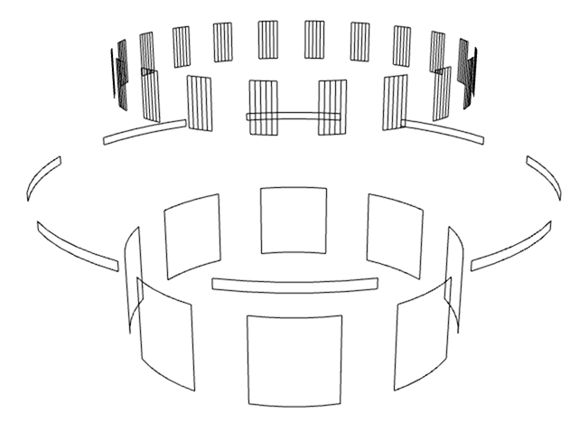

# geo-piecering


[](http://github.com/badges/stability-badges)

Creates a ring cut into piece in 3d space.

## Usage

[](https://www.npmjs.com/package/geo-piecering)

### Example

An example can be found at `./test/index.js`. You can run this test by calling:
```
$ npm test
```

A simple usage example with default values being passed as settings:
```javascript
var geoPieceRing = require('geo-piecering');

// geo will be a Object will two properties:
// positions - the vertices
// cells - the indices to draw the piece ring
var geo = geoPieceRing( {
    cellSize: 3, // 1 == points, 2 == lines, 3 == triangles
    x: 0, // x position of the center of the piece ring
    y: 0, // y position of the center of the piece ring
    z: 0 // z position of the center of the piece ring
    radius: 200, // the radius of the piece ring
    pieceSize: Math.PI * 0.15, // size of the pieces
    startRadian: 0, // radian to start drawing pieces from
    numPieces: 8, // how many pieces to place
    quadsPerPiece: 5, // how many times the piece is split
    height: 10, // the height of the ring
    drawOutline: true // if cellSize == 2 draw only the outside of the shape 
});
```

## License

MIT, see [LICENSE.md](http://github.com/mikkoh/geo-piecering/blob/master/LICENSE.md) for details.
